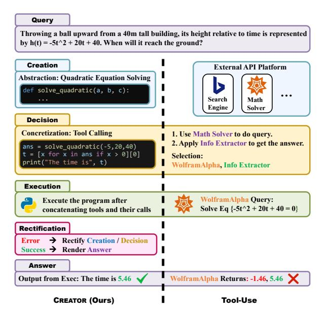
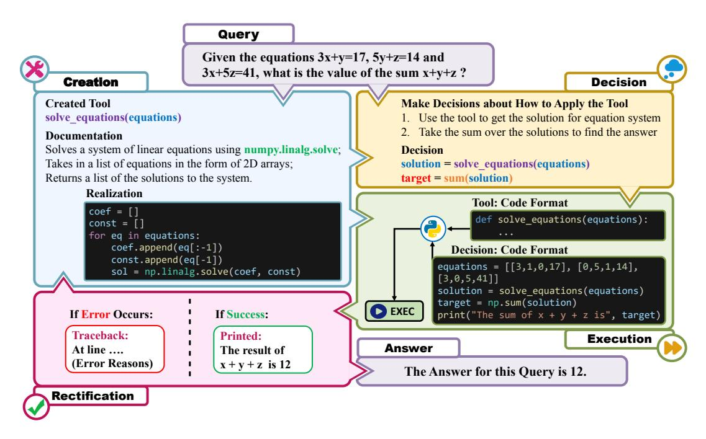
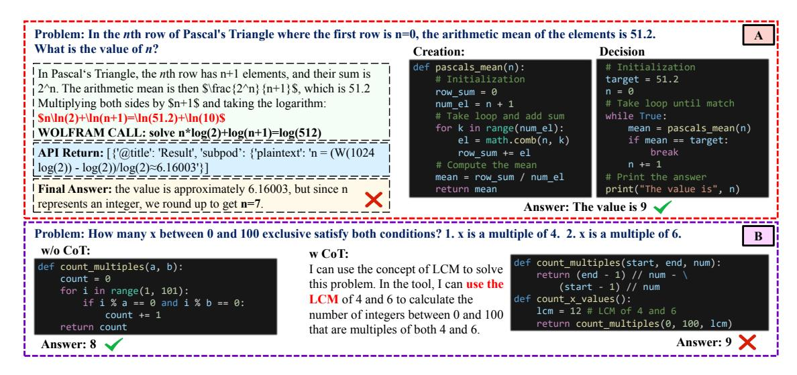
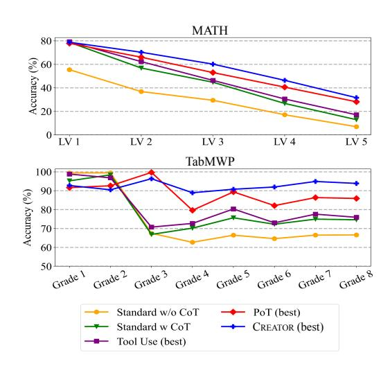
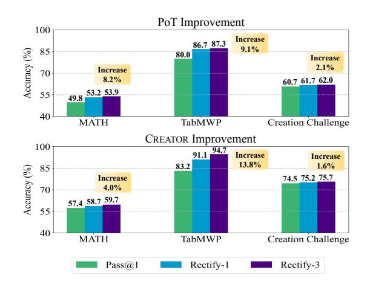
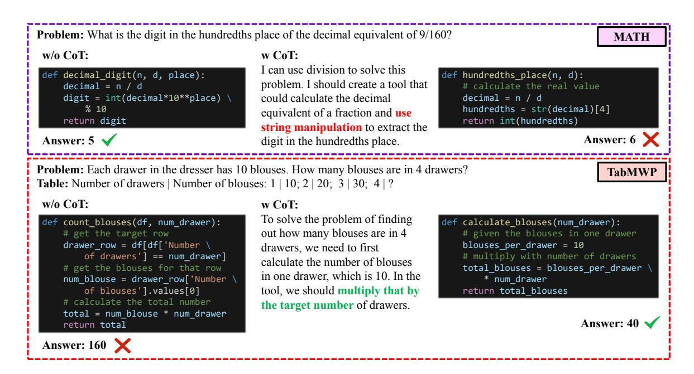
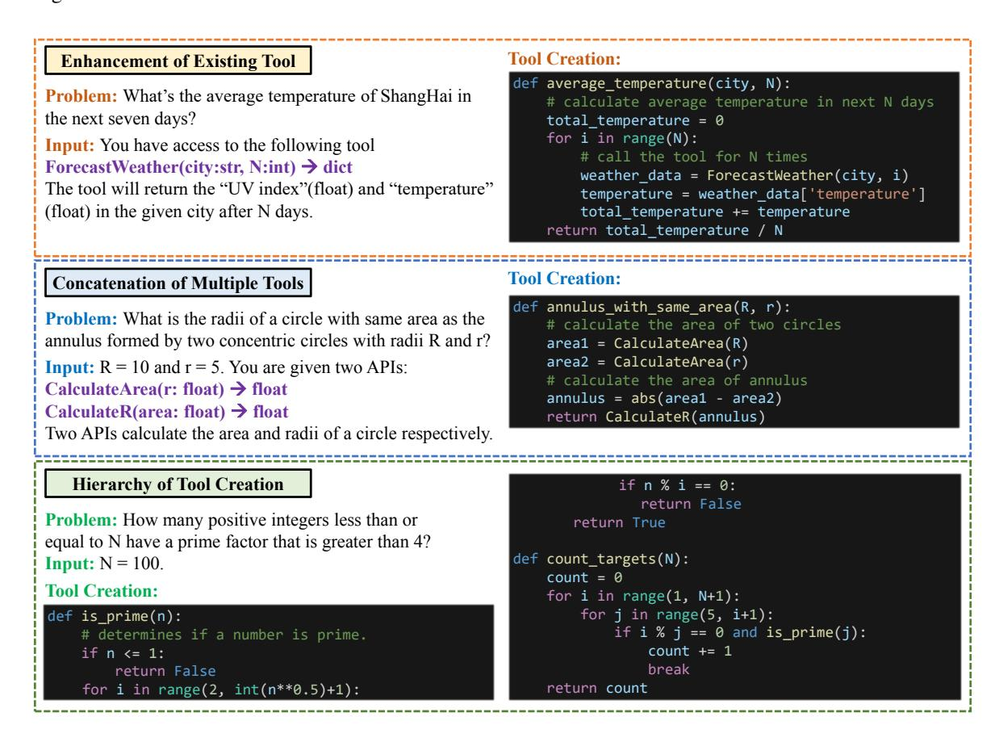

# CREATOR: Tool Creation for Disentangling Abstract and Concrete Reasoning of Large Language Models

Cheng Qian<sup>1</sup> , Chi Han<sup>2</sup> , Yi R. Fung<sup>2</sup> , Yujia Qin<sup>1</sup> , Zhiyuan Liu<sup>1</sup><sup>∗</sup> , Heng Ji<sup>2</sup><sup>∗</sup> <sup>1</sup>Tsinghua University, <sup>2</sup>University of Illinois at Urbana-Champaign qianc20 @ mails.tsinghua.edu.cn

# Abstract

Large Language Models (LLMs) have made significant progress in utilizing tools, but their ability is limited by API availability and the instability of implicit reasoning, particularly when both planning and execution are involved. To overcome these limitations, we propose CREATOR, a novel framework that enables LLMs to create their own tools using documentation and code realization. CREATOR disentangles abstract tool creation and concrete decision execution, resulting in improved performance. We evaluate CREATOR on MATH and TabMWP benchmarks, respectively consisting of challenging math competition problems and diverse tabular contents. Remarkably, CRE-ATOR outperforms existing chain-of-thought, program-of-thought, and tool-using baselines. Additionally, we introduce the Creation Challenge dataset, featuring 2K diverse questions, to emphasize the necessity and benefits of LLMs' tool creation ability. Further research demonstrates that leveraging LLMs as tool creators facilitates knowledge transfer, and LLMs exhibit varying levels of tool creation abilities, enabling them to adapt to diverse situations. The tool creation ability revolutionizes the LLM's problem-solving paradigm, driving us closer to the next frontier of artificial intelligence. All the codes and data are released[1](#page-0-0) .

# 1 Introduction

In recent years, notable progress has been made in large language models (LLMs) like GPT-3 [\(Brown](#page-8-0) [et al.,](#page-8-0) [2020\)](#page-8-0), Codex [\(Chen et al.,](#page-8-1) [2021\)](#page-8-1), PaLM [\(Chowdhery et al.,](#page-8-2) [2022\)](#page-8-2), LLaMA [\(Touvron et al.,](#page-10-0) [2023\)](#page-10-0), ChatGPT [\(OpenAI,](#page-9-0) [2022\)](#page-9-0), and the latest GPT-4 [\(OpenAI,](#page-9-1) [2023\)](#page-9-1). These models exhibit impressive capabilities in in-context learning, code generation, and various Natural Language Processing (NLP) tasks [\(Feng et al.,](#page-9-2) [2020;](#page-9-2) [Dong et al.,](#page-9-3) [2022\)](#page-9-3). However, there are still limitations to address, such as the inability to handle up-to-date information [\(Yu and Ji,](#page-10-1) [2023\)](#page-10-1), provide accurate mathematical results, or reason over long chains of logic [\(Trivedi et al.,](#page-10-2) [2022;](#page-10-2) [Komeili et al.,](#page-9-4) [2022;](#page-9-4) [Patel et al.,](#page-9-5) [2021;](#page-9-5) [Hendrycks et al.,](#page-9-6) [2021;](#page-9-6) [Lu et al.,](#page-9-7) [2022b\)](#page-9-7).

To overcome these concerns, researchers have explored equipping LLMs with external tools to alleviate their memory burden and enhance their expertise [\(Qin et al.,](#page-9-8) [2023\)](#page-9-8). For instance, integrating tools such as question-answering systems or web search engines enables LLMs to learn how and when to access external resources for problemsolving [\(Nakano et al.,](#page-9-9) [2021;](#page-9-9) [Schick et al.,](#page-9-10) [2023\)](#page-9-10). Recent studies have also incorporated additional tools for LLMs, such as GitHub resources, neural network models (e.g., Huggingface library), and code interpreters (e.g., Python interpreter), aiming to enhance their capabilities [\(Gupta and Kembhavi,](#page-9-11) [2022;](#page-9-11) [Surís et al.,](#page-10-3) [2023;](#page-10-3) [Shen et al.,](#page-10-4) [2023;](#page-10-4) [Liang](#page-9-12) [et al.,](#page-9-12) [2023;](#page-9-12) [Lu et al.,](#page-9-13) [2023\)](#page-9-13). These tools require LLMs to provide detailed plans before utilizing them to solve complex problems.

However, tool-augmented LLMs still encounter challenges [\(Chen et al.,](#page-8-3) [2022;](#page-8-3) [Gupta and Kemb](#page-9-11)[havi,](#page-9-11) [2022;](#page-9-11) [Schick et al.,](#page-9-10) [2023;](#page-9-10) [Surís et al.,](#page-10-3) [2023\)](#page-10-3), particularly in the following aspects. (1) Limitation in scope: Current approaches focus on a limited number of tools, making it difficult to find an appropriate existing tool for new problem types. (2) Fragility in reasoning: Given that tasks are often complex, reasoning on the fly case-by-case can be fragile to random errors, while humans can benefit from finding robust commonalities among multiple similar questions. (3) Insufficiency in error-handling: Current tool utilization pipelines lack automatic and specific error handling, necessitating improvements in accuracy and robustness to ensure reliable execution results.

In this paper, we propose a novel approach to ad-

<sup>∗</sup>Corresponding author.

<span id="page-0-0"></span><sup>1</sup> <https://github.com/qiancheng0/CREATOR>

<span id="page-1-0"></span>

Figure 1: The difference between CREATOR and a general tool-using framework.

dress these challenges. Rather than treating LLMs as *users* of tools, we empower them to be *creators* of tools, enabling them to solve problems with higher accuracy and flexibility. We introduce our tool creation framework, CREATOR, which leverages LLMs' ability to create and modify tools based on the problem at hand. Figure 1 illustrates the differences between CREATOR and a general tool-using framework. While the tool-using framework focuses on reasoning to select and plan API usage, our framework emphasizes diversifying tool choices, disentangling abstract and concrete reasoning, and improving robustness and accuracy. Specifically, CREATOR consists of four stages:

- Creation: Create generally applicable tools with documentation and realization through abstract reasoning based on the problem.
- **Decision**: With available tools, decide when and how to use them to solve the problem.
- Execution: Execute the program, applying the chosen tools to solve the problem.
- **Rectification**: Make modifications to tools and decisions based on the execution result.

By introducing these four stages, we aim to better inspire the LLM's creativity and enhance the paradigm's robustness. This design sets CREATOR apart from traditional tool-using and addresses the three challenges we discussed respectively by (1) leveraging LLMs to create tools with higher generality, reusability, and variety, rather than relying on a limited number of given APIs; (2) offload-

ing the cognitive burden of LLMs and disentangling their ability to perform abstract reasoning (creation of generalizable tools) and concrete reasoning (decision-making with details); (3) utilizing code as the medium for tool creation, which is more sensitive to errors, and enabling automatic rectification of tools and decisions based on error tracebacks.

To evaluate our design's effectiveness, we test CREATOR on two existing benchmarks: MATH (Hendrycks et al.) and TabMWP (Lu et al., 2022a), as well as the Creation Challenge dataset we create. The MATH dataset contains diverse and challenging math competition problems, while TabMWP includes a wide range of tabular contexts for problemsolving. Notably, ChatGPT built on CREATOR achieves remarkable average accuracies of 59.7% and 94.7% on MATH and TabMWP respectively, surpassing the standard chain-of-thought (CoT) (Wei et al., 2022), program-of-thought (PoT) (Chen et al., 2022), and tool-using baselines by significant margins.

As existing benchmarks do not specifically evaluate tool creation, we further introduce the Creation Challenge dataset, which consists of novel and challenging problems that are inadequately solved using existing tools or code packages. This dataset highlights the necessity and advantages of LLMs' tool creation ability. In addition, we show experimental results that provide evidence of how tool creation plays a crucial role in promoting knowledge transfer across similar queries that possess common core knowledge but differ in specific scenarios. We also present case studies highlighting the varying levels of tool creation ability observed in LLMs, allowing them to better adapt to diverse problem settings.

# 2 Related Work

Large Language Models. Large Language Models (LLMs) have gained attention for their impressive performance in handling various NLP tasks, following demonstrations and generating high-quality texts and codes (Brown et al., 2020; Chen et al., 2021; Chowdhery et al., 2022; Touvron et al., 2023). Prompting methods such as chain-of-thought (Wei et al., 2022), instruction-following (Wang et al., 2022b; Longpre et al., 2023; Chung et al., 2022; Touvron et al., 2023; Liu et al., 2023), and verification mechanisms (Fung et al., 2023) have been developed to guide LLMs in problem-

solving and align their behavior with human expectations. Our work builds upon these areas, incorporating them into our framework and using them as baselines for complex problem-solving.

Tool Use and Tool Creation. As an emerging field within NLP, the active interaction of LLMs with environments is facilitated through tools that serve as the medium [\(Li et al.,](#page-9-19) [2023\)](#page-9-19). Recent studies address constraints of LLMs, such as the limited real-time responsiveness and inaccurate calculations, by incorporating external tools [\(Trivedi](#page-10-2) [et al.,](#page-10-2) [2022;](#page-10-2) [Komeili et al.,](#page-9-4) [2022;](#page-9-4) [Patel et al.,](#page-9-5) [2021;](#page-9-5) [Lu et al.,](#page-9-7) [2022b\)](#page-9-7). These studies augment LLMs with tools like scratch pads, search engines, QA systems, and calculators [\(Nye et al.,](#page-9-20) [2021;](#page-9-20) [Shuster](#page-10-7) [et al.,](#page-10-7) [2022;](#page-10-7) [Schick et al.,](#page-9-10) [2023\)](#page-9-10) to improve task performance. More recent efforts integrate LLMs' tool-using abilities into a pipeline for task planning, tool calling, and result synthesis [\(Wu et al.,](#page-10-8) [2023;](#page-10-8) [Shen et al.,](#page-10-4) [2023;](#page-10-4) [Liang et al.,](#page-9-12) [2023\)](#page-9-12). In contrast, our work goes further by enabling LLMs to create tools instead of relying solely on existing tools. As our concurrent works, tool creation ability is also investigated under LATM framework [\(Cai et al.,](#page-8-5) [2023\)](#page-8-5) and LLM customization [\(Yuan et al.,](#page-10-9) [2023\)](#page-10-9).

Reasoning and Execution with Program. Reasoning with programs is an emerging field in NLP, whose goal is to leverage codes to do complicated computational reasoning instead of using natural language thoughts. [Chen et al.](#page-8-3) [\(2022\)](#page-8-3) show that code generation improves performance on math datasets, while [Gao et al.](#page-9-21) [\(2022\)](#page-9-21); [Wang et al.](#page-10-10) [\(2022a\)](#page-10-10) further demonstrate the potential of program reasoning on symbolic and algorithmic benchmarks. These efforts present a code-based chain-ofthought with linear logic but produce no enhanced tools capable of being reused or tested. As the concept of tool-using emerges, recent studies begin to incorporate code interpreters as external tools [\(Lu](#page-9-13) [et al.,](#page-9-13) [2023;](#page-9-13) [Mialon et al.,](#page-9-22) [2023;](#page-9-22) [Wang et al.,](#page-10-11) [2023\)](#page-10-11). However, in CREATOR, we use code as the medium for tool creation rather than an external tool. Our framework also excels over PoT as we devise the tool creation stage, code rectification stage, and disentangle the logic in complex reasonings.

# <span id="page-2-1"></span>3 Design of CREATOR

Distinct from previous frameworks for tool-using, CREATOR leverages the tool creation ability of LLMs by incorporating four special stages: cre-

<span id="page-2-0"></span>

| Method   | Create<br>Tools | Utilize<br>Tools | Apply<br>Codes | Emphasize<br>Reusability | Reasoning<br>Pattern |
|----------|-----------------|------------------|----------------|--------------------------|----------------------|
| CoT      | -               | -                | -              | -                        | Linear               |
| PoT      | -               | -                | ✓              | -                        | Linear               |
| Tool Use | -               | ✓                | ✓              | -                        | Linear               |
| CREATOR  | ✓               | ✓                | ✓              | ✓                        | Non-Linear           |

Table 1: A comprehensive comparison of CREATOR with other methods.

ation, decision, execution, and rectification, as illustrated in Figure [2.](#page-3-0) The utilization of tool creation for problem-solving is inherently straightforward and aligns with LLMs' innate ability, as illustrated later in Section [5.2.](#page-7-0) In CREATOR, the main objective of design is to instinctively better inspire their creativity, and facilitate more effective use of it.

Previous CoT and PoT methods mainly apply linear reasoning to solve target problems, and their task-solving process lacks reusability. However, the tools created in CREATOR can be transferred to solve other queries, and the rectification stage incorporated makes the reasoning process non-linear. We present a comprehensive comparison between CREATOR and other methods in Table [1.](#page-2-0)

### 3.1 Creation Stage

Implementation Details. In the creation stage of CREATOR, we explicitly instruct LLMs with demonstrative examples to create tools and documentation to solve the problem. The general prompt text form is "###Instruction [INSTRUCTION]\n [EXAMPLE 1]\n [EXAMPLE 2] ...". Here the instruction text "[INSTRUCTION]" describes the goal and format of the output. Each demonstration "[EXAMPLE x]" follows format "### Question [QST]\n ### Tool [TOOL]". Each [TOOL] contains documentation text as code comments. A detailed example of prompt text is shown in Figure [14.](#page-16-0)

To get these demonstrations, we make a fixed set of demonstrations in advance and use them subsequently for each task. In specific, we randomly select a subset from the training set and prompt the LLM with the text instruction for tool creation for each query. We then correct the errors in these generations (if any) and remove verbose explanations before using them. Although the demonstrations are from the same task as the test queries, they are not required to be semantically similar to test queries, as the main purpose is only to inspire the

<span id="page-3-0"></span>

Figure 2: Overview of our CREATOR framework with four stages: Creation, Decision, Execution, and Rectification. With an LLM like ChatGPT, we successfully leverage its tool creation ability with code as the medium. In each stage we apply instructions and demonstrations in prompts, shown in Figures [14](#page-16-0) to [16](#page-17-0) in Appendices.

LLM's creativity and regulate its output format.

Ability of Abstract Reasoning. The core importance of the tool creation stage is to trigger LLM's ability to employ abstract thinking to alleviate the burden of reasoning during later stages. When LLMs create tools, they effectively use abstraction to address a particular problem type, necessitating a focus on the inherent characteristics of the problem rather than the specific numerical details. For example, in Figure [2,](#page-3-0) the LLM concentrates solely on recognizing the intrinsic nature of the problem and creates a tool for solving a three-variable equation system, disregarding all the numerical details and the specific expression being queried.

### 3.2 Decision Stage

Implementation Details. Similar to the creation stage, we instruct LLMs with demonstrations to decide how to use tools with the same prompt text form. Each demonstration "[EXAMPLE x]" follows "### Question [QST]\n ### Tool [TOOL]\n ### Solution [SOL]", where [SOL] represents the LLM's decision tool calls in code format. We also derive a fixed demonstration set the same way as in the creation stage, only that the LLM is now prompted to call the given tools instead of creating them, and to print out the final answer with any important information through "*print(...)*" in

codes. This [INSTRUCTION] applies both to get demonstrations and to conduct test-time inference, which ensures that the LLM's answer can be easily extracted from printed outputs in subsequent stages. A detailed prompt text example is shown in Figure [15.](#page-16-1)

Ability of Concrete Reasoning. The decision stage necessitates the LLM's meticulous attention to rules and details for problem-solving, which we refer to as concrete reasoning. In Figure [2,](#page-3-0) the solution obtained from the tool needs to be summed for the final answer. This requires the LLM to understand the tool's outputs and relate them to the specific query to make an informed decision and derive the correct answer finally. By separating creation from the decision, CREATOR disentangles two phases of the LLM's abilities, which facilitates a smoother elicitation of different aspects of knowledge and improves task performance.

### 3.3 Execution Stage

The execution stage takes the information from previous stages to execute the tool leveraging the code interpreter. We do not apply the LLM in this stage, and the created tools and the LLM's decision are concatenated into a cohesive code block for execution. The tool is encapsulated within a function in the code block, and the LLM's decision calls it

for problem-solving. During execution, we capture any outputs printed (as we have instructed the LLM in the decision stage)

or errors encountered (by intercepting error messages in a sub-process). These information serve as inputs for subsequent stages to determine whether an answer can be obtained or rectifications are needed.

## 3.4 Rectification Stage

Implementation Details. During the rectification stage, CREATOR has two different options based on the information passed into it. If an error occurs, then the LLM is prompted with demonstrations to rectify the error. Applying a similar prompt format as before, the format of demonstrations "[EXAMPLE x]" now changes to "### Question [QST]\n ### Original [ORI]\n ### Error [ERR]\n ### Rectification [REC]", where we provide the original tool implementation and calling decision in [ORI], offer the error tracebacks [ERR], and concatenate natural language reasoning on the error with the rectified code in [REC]. A detailed illustration of the prompt text is shown in Figure [16.](#page-17-0)

If the execution is successful, then the answer will be extracted from the captured model's output and compared to the standard answer to measure accuracy.

Significance. During the rectification process, we provide the LLM with error tracebacks, which offer crucial information for it to identify the error's location and causes. Armed with this guidance, the LLM can recover from previous mistakes, adjust its reasoning process, and attempt to solve the problem once again. Subsequent experiments will demonstrate how the inclusion of rectification significantly improves the performance of CRE-ATOR. The success of the rectification stage also showcases the LLM's ability to recognize misconceptions and self-correct.

# 4 Experiments

To evaluate the effectiveness of CREATOR, we conduct experiments on two established benchmarks: MATH [\(Hendrycks et al.\)](#page-9-14) and TabMWP [\(Lu et al.,](#page-9-15) [2022a\)](#page-9-15). Additionally, we perform experiments on a newly introduced dataset, Creation Challenge, comprising 2K diverse questions that are inadequate to solve using existing tools or code packages. This

enables us to further demonstrate the necessity and advantages of the LLM's tool creation ability.

# 4.1 Experimental Setup

Settings. We select ChatGPT as the base model for all methods due to its exceptional capabilities in code generation, decision-making, and logical reasoning. Refer to Appendices [A.1](#page-11-0) for more details. We evaluate CREATOR on two existing datasets: TabMWP, which includes diverse tablerelated problems, and MATH, consisting of challenging math competition problems. We apply them as they are representative in terms of diversity in data format and difficulty. We also assess the performance of our framework on Creation Challenge, comprising 2K data points, to explore the impact of tool creation hints on the LLM's performance. Refer to Appendices [A.2](#page-11-1) for more details.

Baselines. We compare CREATOR against four types of baselines to demonstrate its effectiveness:

- Vanilla LLM w/ and w/o CoT: The Vanilla LLM with CoT employs linear reasoning to solve problems, while Vanilla LLM without CoT directly generates the answer.
- PoT: The LLM utilizes a program to reason through the problem step by step. Besides, we also incorporate rectification into PoT as a stronger baseline for a fair comparison.
- Tool Use: The LLM utilizes the WolframAlpha API as a general-purpose tool specialized in calculations. It's a fair external tool as all queries require numerical reasoning to some extent.
- CREATOR-Entangled: The LLM combines the creation and the decision stage in CREATOR instead of disentangling them, which serves as a special baseline for ablation study.

### 4.2 Creation Challenge

Existing benchmarks are not originally designed to evaluate tool creation, thus unable to fully showcase the necessity and advantages brought by the LLM's tool creation ability. Therefore, we introduce Creation Challenge to test the LLM's problemsolving skills under new scenarios, without existing tools or code packages that can be directly applied. Refer to Appendices [B.1](#page-11-2) for details about the data format and construction process.

Evaluation The components of the standard created tool in each data point of Creation Challenge can serve as valuable hints for the LLM's tool

<span id="page-5-0"></span>

| Method                | Setting                        | Algebra              | Counting & Probability | Geometry             | Itmd.<br>Algebra            | Number<br>Theory     | Pre-<br>Algebra      | Pre-<br>Calculus            | Average<br>(weighted) |
|-----------------------|--------------------------------|----------------------|------------------------|----------------------|-----------------------------|----------------------|----------------------|-----------------------------|-----------------------|
| Vanilla               | w/o CoT                        | 25.7                 | 25.8                   | 22.4                 | 13.9                        | 18.5                 | 40.9                 | 21.8                        | 25.3                  |
|                       | w/ CoT                         | 50.9                 | 36.1                   | 24.5                 | 17.5                        | 23.2                 | 58.6                 | 16.7                        | 37.9                  |
| PoT (w/o Rec.)        | w/o CoT                        | 58.2                 | 48.5                   | 35.4                 | 25.8                        | 53.1                 | 66.8                 | 25.0                        | 49.8                  |
|                       | w/ CoT                         | 54.0                 | 47.8                   | 32.5                 | 22.3                        | 48.9                 | 64.5                 | 19.9                        | 46.5                  |
| PoT (w/ Rec.)         | w/o CoT                        | 63.8                 | 51.9                   | 35.9                 | 28.6                        | 59.2                 | 70.0                 | 28.2                        | 53.9                  |
|                       | w/ CoT                         | 61.4                 | 48.8                   | 34.6                 | 23.7                        | 54.5                 | 67.6                 | 34.6                        | 51.2                  |
| Tool Use              | w/o CoT                        | 47.3                 | 35.1                   | 27.0                 | 20.5                        | 30.8                 | 56.8                 | 31.4                        | 39.0                  |
|                       | w/ CoT                         | 55.3                 | 37.8                   | 28.7                 | 20.5                        | 34.8                 | 61.8                 | 26.9                        | 43.0                  |
| CREATOR<br>-Entangled | w/o Demo.<br>w/o CoT<br>w/ CoT | 58.0<br>64.1<br>62.7 | 53.3<br>55.7<br>50.9   | 34.2<br>35.9<br>33.8 | 21.8<br><b>42.7</b><br>31.4 | 55.7<br>61.6<br>61.4 | 63.4<br>69.0<br>68.7 | 33.3<br><b>37.2</b><br>31.4 | 49.6<br>57.2<br>54.0  |
| CREATOR (ours)        | w/o Demo.                      | 66.6                 | 53.6                   | 33.8                 | 29.4                        | 59.8                 | 68.7                 | 34.6                        | 54.9                  |
|                       | w/o CoT                        | <b>71.5</b>          | 55.3                   | <b>41.4</b>          | 41.9                        | 60.4                 | <b>71.7</b>          | 35.3                        | <b>59.7</b>           |
|                       | w/ CoT                         | 63.1                 | <b>58.1</b>            | 34.6                 | 35.0                        | <b>61.8</b>          | 69.7                 | 32.1                        | 55.7                  |

Table 2: The accuracy (%) on the test set of MATH dataset leveraging ChatGPT. Rec. represents Rectification.

creation. Therefore, we extend our experiments on Creation Challenge to assess the LLM's tool creation ability with varying levels of hint utilization. We encourage future research to explore the dataset's potential through more flexible usage.

### 4.3 Experimental Results

We present the results on MATH, TabMWP, and Creation Challenge respectively in Tables 2 to 4. CREATOR achieves an accuracy of 59.7%, 94.7%, and 75.5% respectively on three tasks, surpassing all the best performance in baselines by large margins. To illustrate CREATOR's advantage, we present a case study showing how it's better than Tool Use in Figure 3A. For all tasks, disentangling the creation and decision stages generally results in better performance, compared to CREATOR-Entangled. For Creation Challenge, we also observe that hints of tool creation can raise the performance up to 18.7%. We will further analyze the reasons for this improvement in Section 4.4.

### <span id="page-5-1"></span>4.4 Results Analysis

CoT Incompatible with Codes. Table 2 shows the LLM's performance on MATH problems decreases consistently when applying CoT under PoT method and CREATOR, and the opposite trend is observed for TabMWP. We attribute this difference to the inherent incompatibility between natural language reasoning and program-based reasoning on challenging problems. MATH problems involve intricate calculations and diverse reasoning paths, leading to conflicts between natural language and programming approaches. When CoT is used, the LLM tends to generate programs following natural

| Method            | Setting | Accuracy    | Successful<br>Execution |
|-------------------|---------|-------------|-------------------------|
| Standard          | w/o CoT | 68.2        | 99.1                    |
|                   | w/ CoT  | 75.2        | 99.3                    |
| PoT (w/o Rec.)    | w/o CoT | 80.6        | 98.5                    |
|                   | w/ CoT  | 80.0        | 91.2                    |
| PoT (w/ Rec.)     | w/o CoT | 81.2        | 99.7                    |
|                   | w/ CoT  | 87.3        | 100                     |
| Tool Use          | w/o CoT | 77.6        | 100                     |
|                   | w/ CoT  | 79.6        | 100                     |
| CREATOR-Entangled | w/o CoT | 91.6        | 100                     |
|                   | w/ CoT  | 93.5        | 99.9                    |
| CREATOR (ours)    | w/o CoT | 90.5        | 99.7                    |
|                   | w/ CoT  | <b>94.7</b> | 100                     |

Table 3: The accuracy (%) on the test set of TabMWP dataset leveraging ChatGPT. *Successful Execution* indicates whether the LLM provides a valid final answer through words or codes within the rectification limit.

language reasoning, which compromises the coherence and unique advantages of programming. In Figure 3B. we show the adoption of brute-force algorithms and straightforward calculations when CoT is not applied yields higher accuracy.

In contrast, TabMWP involves simpler calculations and more straightforward reasoning paths, promoting consistency between natural language and programming reasoning. Therefore, the application of CoT enhances performance in these cases. We present more case studies to illustrate it in Appendices C.1.

CREATOR is Robust to Challenges. Figure 4 illustrates the performance of the LLM in relation to difficulty. CREATOR outperforms all the baselines for both tasks and achieves higher accuracy, particularly for difficult problems. This provides com-

<span id="page-6-1"></span>

Figure 3: In subfigure A, we show an example in which Tool Use reasoning (left) fails, while CREATOR (right) solves successfully as it derives a new tool for the novel question. In subfigure B, we present a case comparing the answer given by CREATOR with and without CoT. Challenging problems in MATH cause conflicts between language and program reasoning.

<span id="page-6-0"></span>

| Method                      | Setting      | Accuracy    | Successful<br>Execution |
|-----------------------------|--------------|-------------|-------------------------|
| Standard                    | w/o CoT      | 27.9        | 94.9                    |
|                             | w/ CoT       | 32.7        | 99.1                    |
| PoT (w/o Rec.)              | w/o CoT      | 59.2        | 93.5                    |
|                             | w/ CoT       | 60.7        | 95.7                    |
| PoT (w/ Rec.)               | w/o CoT      | 61.1        | 98.3                    |
|                             | w/ CoT       | 62.0        | 98.9                    |
| CREATOR-Entangled (w/o CoT) | no hint      | 64.5        | 99.2                    |
|                             | utility hint | 65.8        | 99.3                    |
|                             | all hint     | 75.3        | 99.5                    |
| CREATOR (ours) (w/o CoT)    | no hint      | 63.8        | 98.7                    |
|                             | utility hint | 67.2        | 99.1                    |
|                             | all hint     | <b>75.7</b> | 99.5                    |

Table 4: The accuracy (%) on the Creation Challenge test set leveraging ChatGPT. *No hint* represents normal CREATOR framework. *Utility hint* provides hints about the utility of the tool, while *all hint* offers additional hints about the possible inputs and outputs of the tool.


**Rectification Raises Performance.** Figure 5 demonstrates the improvement in the LLM's performance achieved through the application of the rectification stage. Results show rectification can increase the accuracy by approximately 10% of the original value, which proves the necessity and rationality of establishing this stage.

**Influential Factors of Tool Creation.** Tables 2 to 4 highlight two crucial factors affecting the LLM's performance. (1) **Separation of Creation** 

<span id="page-6-2"></span>

Figure 4: Comparison of the accuracy of baselines and CREATOR *w.r.t.* problem difficulty.

and Decision: The separation of these two stages inherently represents the disentanglement of the LLM's abstract and concrete reasoning, which leads to improved performance. (2) Availability of Hints: In practical scenarios, guidance is often necessary to harness the LLM's behavior when creating tools. We demonstrate that providing more detailed hints can significantly improve the LLM's performance, as they enable easier implementation of desired tools and eliminate uncertainty and misdirections in CoT or tool documentation.

<span id="page-7-1"></span>

Figure 5: The improvement brought by rectification on both PoT and CREATOR. *Rectify-N* denotes enabling N rounds of rectifications.

<span id="page-7-2"></span>

| Set of Queries, Count           | 100             |
|---------------------------------|-----------------|
| Data Pieces, Count              | 300             |
| Tool Create Normal, Acc.        | 63.0%           |
| Tool Create with Transfer, Acc. | 78.3%           |
| Increase of Acc.                | <b>15.3%</b>    |
| Sets Worse with Transfer        | 2 / 100         |
| Sets Better with Transfer       | <b>39 / 100</b> |

Table 5: Results of tool transfer experiment. Tool transfer improves accuracy by up to 15.3%.

### 5 Further Analysis

In this section, we further show the advantages brought by the LLM's tool creation ability and use case studies to demonstrate different aspects of this ability, which enables them to tackle challenges with more flexibility and less reasoning burden.

### 5.1 Facilitation of Knowledge Transfer

One of the main purposes of tool creation lies in its reusability. The content of tools represents the abstraction of knowledge concepts, so the creation of one tool may help solve problems of various scenarios that share the same core concept. For instance, a keyword-extraction tool created for sentiment analysis can be applied to other tasks like document categorization and topic modeling, as they all require the identification and extraction of relevant keywords for problem-solving. By utilizing the knowledge and logic embedded in the tool, the LLM can transfer its understanding to solve similar problems efficiently with higher performance.

**Settings.** To validate our hypothesis, we construct a small set of questions with 300 data points, detailed in Appendices B.2. We divide data

points into 100 sets, where all three queries in one set share the same core knowledge concept (key methodology that is universally applicable) but differ in scenario (problem background and specific details inquired).

Similar to previous experiments, we use Chat-GPT as the base LLM with unchanged detailed settings. We first test all the problems under the normal CREATOR framework respectively. Then, we test if the correct tool created under one scenario could be applied to the other two, and again test the LLM's performance.

Results Analysis. The statistics are presented in Table 5. Through the application of transferred tools, the LLM's accuracy can be raised by 15.3%. Further analysis shows that 39 sets of queries are positively influenced by this transfer, which highlights the tool creation ability of the LLM can facilitate knowledge transfer, leading to better performance on clusters of problems that share similar core concepts.

### <span id="page-7-0"></span>5.2 Different Levels of LLM's Tool Creation

We discover in experiments that LLM can create tools in different levels without special guidance, which affirms creativity is LLM's intrinsic emerging ability. By inspecting the created tools, we find that they can be categorized into three levels, which provides guidance and reference for future development.

- **1.** Enhancement of Existing Tool. First, LLMs demonstrate the capability to enhance existing tools by encapsulating an existing tool or API and repurposing it to serve different needs. The first case of Figure 9 shows how LLM wraps an existing weather query API into a new tool that calculates the average temperature.
- **2.** Concatenation of Multiple Tools. Second, the LLM can create new tools by organizing multiple APIs into a pipeline, enabling it to fulfill specific purposes. The second case in Figure 9 shows how the LLM calls two existing APIs three times in the new tool for problem-solving.
- **3. Hierarchical Tool.** Third, the LLM can create tools with a clear hierarchy, which establishes clear caller-callee relationships among tools and reduces the burden of repetitive reasoning. The third case in Figure 9 illustrates a hierarchical structure where the first tool serves as the callee, while the second tool primarily solves the problem.

# 6 Conclusion

We propose the concept of automatic tool creation through LLMs and empirically devise CREATOR that harnesses the capabilities of LLMs as tool creators. By disentangling LLM's abstract and concrete reasoning, CREATOR enables clearer logic and enhances overall performance. Through comprehensive evaluations on established benchmarks and Creation Challenge, we demonstrate the superiority and indispensability of CREATOR compared to existing CoT, PoT, and tool-using approaches. We anticipate our study will inspire the development of more sophisticated AI systems leveraging LLM's tool creation potential.

# Limitations

Our experiment is limited to two established benchmarks, MATH and TabMWP, along with our newly introduced dataset, Creation Challenge. However, it is crucial for future research to expand the application of our framework to encompass a broader array of tasks. This will enable a comprehensive assessment of the generalizability of our results, going beyond the scope of our current investigation.

Furthermore, our demonstration of the LLM's potential in tool creation is limited in scope. For instance, the current LLM is also capable of creating tools even to build a full project pipeline, but the execution ability and correctness of its creation still lack proper evaluations and remain questionable. It is incumbent upon future research to delve deeper into the boundaries of LLM's capabilities and establish clear limits regarding its tool creation potential.

# Ethics Statement

We consider the following research issues in this paper:

• Privacy involves safeguarding sensitive information and preventing its unauthorized disclosure. With respect to our framework, privacy becomes a concern when certain stages require demonstration examples and clear instructions, which may inadvertently contain sensitive information, or intentionally designed to prompt the LLM to leak privacy. Thus, it is crucial to ensure that personal or sensitive information is not disclosed to the closed-source LLM, and the private information or knowledge about tool creation in the

closed-source LLM should be well-protected.

- Fairness in AI aims to ensure the outputs and decisions made by AI systems do not perpetuate existing biases or discriminations. When creating tools, care must be taken to mitigate biases in the demonstrations and instructions, monitor the tool's performance across stages, and address any disparities that may arise in the whole generation or rectification process.
- Transparency involves making AI systems and their processes understandable and interpretable. When the language model creates tools under our framework, it's essential to have transparency regarding how those tools are developed. Developers should document any biases or limitations associated with the tools created, understand the strengths and weaknesses of the tools and how the decision is reached, and make informed decisions about their application.

# References

<span id="page-8-0"></span>Tom Brown, Benjamin Mann, Nick Ryder, Melanie Subbiah, Jared D Kaplan, Prafulla Dhariwal, Arvind Neelakantan, Pranav Shyam, Girish Sastry, Amanda Askell, et al. 2020. Language models are few-shot learners. *Advances in neural information processing systems*, 33:1877–1901.

<span id="page-8-5"></span>Tianle Cai, Xuezhi Wang, Tengyu Ma, Xinyun Chen, and Denny Zhou. 2023. [Large language models as](http://arxiv.org/abs/2305.17126) [tool makers.](http://arxiv.org/abs/2305.17126)

<span id="page-8-1"></span>Mark Chen, Jerry Tworek, Heewoo Jun, Qiming Yuan, Henrique Ponde de Oliveira Pinto, Jared Kaplan, Harri Edwards, Yuri Burda, Nicholas Joseph, Greg Brockman, et al. 2021. Evaluating large language models trained on code. *arXiv preprint arXiv:2107.03374*.

<span id="page-8-3"></span>Wenhu Chen, Xueguang Ma, Xinyi Wang, and William W Cohen. 2022. Program of thoughts prompting: Disentangling computation from reasoning for numerical reasoning tasks. *arXiv preprint arXiv:2211.12588*.

<span id="page-8-2"></span>Aakanksha Chowdhery, Sharan Narang, Jacob Devlin, Maarten Bosma, Gaurav Mishra, Adam Roberts, Paul Barham, Hyung Won Chung, Charles Sutton, Sebastian Gehrmann, et al. 2022. Palm: Scaling language modeling with pathways. *arXiv preprint arXiv:2204.02311*.

<span id="page-8-4"></span>Hyung Won Chung, Le Hou, Shayne Longpre, Barret Zoph, Yi Tay, William Fedus, Eric Li, Xuezhi Wang, Mostafa Dehghani, Siddhartha Brahma, et al. 2022. Scaling instruction-finetuned language models. *arXiv preprint arXiv:2210.11416*.

- <span id="page-9-3"></span>Qingxiu Dong, Lei Li, Damai Dai, Ce Zheng, Zhiyong Wu, Baobao Chang, Xu Sun, Jingjing Xu, and Zhifang Sui. 2022. A survey for in-context learning. *arXiv preprint arXiv:2301.00234*.
- <span id="page-9-2"></span>Zhangyin Feng, Daya Guo, Duyu Tang, Nan Duan, Xiaocheng Feng, Ming Gong, Linjun Shou, Bing Qin, Ting Liu, Daxin Jiang, et al. 2020. Codebert: A pre-trained model for programming and natural languages. *arXiv preprint arXiv:2002.08155*.
- <span id="page-9-18"></span>Yi R. Fung, Tuhin Chakraborty, Hao Guo, Owen Rambow, Smaranda Muresan, and Heng Ji. 2023. Normsage: Multi-lingual multi-cultural norm discovery from conversations on-the-fly. In *Proceedings of the 2023 Conference on Empirical Methods in Natural Language Processing*.
- <span id="page-9-21"></span>Luyu Gao, Aman Madaan, Shuyan Zhou, Uri Alon, Pengfei Liu, Yiming Yang, Jamie Callan, and Graham Neubig. 2022. Pal: Program-aided language models. *arXiv preprint arXiv:2211.10435*.
- <span id="page-9-11"></span>Tanmay Gupta and Aniruddha Kembhavi. 2022. Visual programming: Compositional visual reasoning without training. *arXiv preprint arXiv:2211.11559*.
- <span id="page-9-14"></span>Dan Hendrycks, Collin Burns, Saurav Kadavath, Akul Arora, Steven Basart, Eric Tang, Dawn Song, and Jacob Steinhardt. Measuring mathematical problem solving with the math dataset. *Sort*, 2(4):0–6.
- <span id="page-9-6"></span>Dan Hendrycks, Collin Burns, Saurav Kadavath, Akul Arora, Steven Basart, Eric Tang, Dawn Song, and Jacob Steinhardt. 2021. Measuring mathematical problem solving with the math dataset. *arXiv preprint arXiv:2103.03874*.
- <span id="page-9-4"></span>Mojtaba Komeili, Kurt Shuster, and Jason Weston. 2022. Internet-augmented dialogue generation. In *Proceedings of the 60th Annual Meeting of the Association for Computational Linguistics (Volume 1: Long Papers)*, pages 8460–8478.
- <span id="page-9-19"></span>Sha Li, Chi Han, Pengfei Yu, Carl Edwards, Manling Li, Xingyao Wang, Yi Fung, Charles Yu, Joel Tetreault, Eduard Hovy, and Heng Ji. 2023. Defining a new nlp playground. In *Proceedings of the 2023 Conference on Empirical Methods in Natural Language Processing Findings*.
- <span id="page-9-12"></span>Yaobo Liang, Chenfei Wu, Ting Song, Wenshan Wu, Yan Xia, Yu Liu, Yang Ou, Shuai Lu, Lei Ji, Shaoguang Mao, et al. 2023. Taskmatrix. ai: Completing tasks by connecting foundation models with millions of apis. *arXiv preprint arXiv:2303.16434*.
- <span id="page-9-17"></span>Haotian Liu, Chunyuan Li, Qingyang Wu, and Yong Jae Lee. 2023. Visual instruction tuning. *arXiv preprint arXiv:2304.08485*.
- <span id="page-9-16"></span>Shayne Longpre, Le Hou, Tu Vu, Albert Webson, Hyung Won Chung, Yi Tay, Denny Zhou, Quoc V Le, Barret Zoph, Jason Wei, et al. 2023. The flan collection: Designing data and methods for effective instruction tuning. *arXiv preprint arXiv:2301.13688*.

- <span id="page-9-13"></span>Pan Lu, Baolin Peng, Hao Cheng, Michel Galley, Kai-Wei Chang, Ying Nian Wu, Song-Chun Zhu, and Jianfeng Gao. 2023. Chameleon: Plug-and-play compositional reasoning with large language models. *arXiv preprint arXiv:2304.09842*.
- <span id="page-9-15"></span>Pan Lu, Liang Qiu, Kai-Wei Chang, Ying Nian Wu, Song-Chun Zhu, Tanmay Rajpurohit, Peter Clark, and Ashwin Kalyan. 2022a. Dynamic prompt learning via policy gradient for semi-structured mathematical reasoning. *arXiv preprint arXiv:2209.14610*.
- <span id="page-9-7"></span>Pan Lu, Liang Qiu, Wenhao Yu, Sean Welleck, and Kai-Wei Chang. 2022b. A survey of deep learning for mathematical reasoning. *arXiv preprint arXiv:2212.10535*.
- <span id="page-9-22"></span>Grégoire Mialon, Roberto Dessì, Maria Lomeli, Christoforos Nalmpantis, Ram Pasunuru, Roberta Raileanu, Baptiste Rozière, Timo Schick, Jane Dwivedi-Yu, Asli Celikyilmaz, Edouard Grave, Yann LeCun, and Thomas Scialom. 2023. [Augmented language mod](http://arxiv.org/abs/2302.07842)[els: a survey.](http://arxiv.org/abs/2302.07842)
- <span id="page-9-9"></span>Reiichiro Nakano, Jacob Hilton, Suchir Balaji, Jeff Wu, Long Ouyang, Christina Kim, Christopher Hesse, Shantanu Jain, Vineet Kosaraju, William Saunders, et al. 2021. Webgpt: Browser-assisted questionanswering with human feedback. *arXiv preprint arXiv:2112.09332*.
- <span id="page-9-20"></span>Maxwell Nye, Anders Johan Andreassen, Guy Gur-Ari, Henryk Michalewski, Jacob Austin, David Bieber, David Dohan, Aitor Lewkowycz, Maarten Bosma, David Luan, et al. 2021. Show your work: Scratchpads for intermediate computation with language models. *arXiv preprint arXiv:2112.00114*.
- <span id="page-9-0"></span>OpenAI. 2022. Chatgpt.
- <span id="page-9-1"></span>OpenAI. 2023. [Gpt-4 technical report.](http://arxiv.org/abs/2303.08774)
- <span id="page-9-5"></span>Arkil Patel, Satwik Bhattamishra, and Navin Goyal. 2021. Are nlp models really able to solve simple math word problems? In *Proceedings of the 2021 Conference of the North American Chapter of the Association for Computational Linguistics: Human Language Technologies*, pages 2080–2094.
- <span id="page-9-8"></span>Yujia Qin, Shengding Hu, Yankai Lin, Weize Chen, Ning Ding, Ganqu Cui, Zheni Zeng, Yufei Huang, Chaojun Xiao, Chi Han, Yi Ren Fung, Yusheng Su, Huadong Wang, Cheng Qian, Runchu Tian, Kunlun Zhu, Shihao Liang, Xingyu Shen, Bokai Xu, Zhen Zhang, Yining Ye, Bowen Li, Ziwei Tang, Jing Yi, Yuzhang Zhu, Zhenning Dai, Lan Yan, Xin Cong, Yaxi Lu, Weilin Zhao, Yuxiang Huang, Junxi Yan, Xu Han, Xian Sun, Dahai Li, Jason Phang, Cheng Yang, Tongshuang Wu, Heng Ji, Zhiyuan Liu, and Maosong Sun. 2023. [Tool learning with foundation](http://arxiv.org/abs/2304.08354) [models.](http://arxiv.org/abs/2304.08354)
- <span id="page-9-10"></span>Timo Schick, Jane Dwivedi-Yu, Roberto Dessì, Roberta Raileanu, Maria Lomeli, Luke Zettlemoyer, Nicola Cancedda, and Thomas Scialom. 2023. Toolformer: Language models can teach themselves to use tools. *arXiv preprint arXiv:2302.04761*.

- <span id="page-10-4"></span>Yongliang Shen, Kaitao Song, Xu Tan, Dongsheng Li, Weiming Lu, and Yueting Zhuang. 2023. Hugginggpt: Solving ai tasks with chatgpt and its friends in huggingface. *arXiv preprint arXiv:2303.17580*.
- <span id="page-10-7"></span>Kurt Shuster, Jing Xu, Mojtaba Komeili, Da Ju, Eric Michael Smith, Stephen Roller, Megan Ung, Moya Chen, Kushal Arora, Joshua Lane, et al. 2022. Blenderbot 3: a deployed conversational agent that continually learns to responsibly engage. *arXiv preprint arXiv:2208.03188*.
- <span id="page-10-3"></span>Dídac Surís, Sachit Menon, and Carl Vondrick. 2023. Vipergpt: Visual inference via python execution for reasoning. *arXiv preprint arXiv:2303.08128*.
- <span id="page-10-0"></span>Hugo Touvron, Thibaut Lavril, Gautier Izacard, Xavier Martinet, Marie-Anne Lachaux, Timothée Lacroix, Baptiste Rozière, Naman Goyal, Eric Hambro, Faisal Azhar, et al. 2023. Llama: Open and efficient foundation language models. *arXiv preprint arXiv:2302.13971*.
- <span id="page-10-2"></span>Harsh Trivedi, Niranjan Balasubramanian, Tushar Khot, and Ashish Sabharwal. 2022. Interleaving retrieval with chain-of-thought reasoning for knowledge-intensive multi-step questions. *arXiv preprint arXiv:2212.10509*.
- <span id="page-10-10"></span>Xingyao Wang, Sha Li, and Heng Ji. 2022a. Code4structure: Code generation for few-shot structure prediction from natural language. In *arxiv*.
- <span id="page-10-11"></span>Xingyao Wang, Hao Peng, Reyhaneh Jabbarvand, and Heng Ji. 2023. Learning to generate from textual interactions. In *arxiv*.
- <span id="page-10-6"></span>Yizhong Wang, Swaroop Mishra, Pegah Alipoormolabashi, Yeganeh Kordi, Amirreza Mirzaei, Atharva Naik, Arjun Ashok, Arut Selvan Dhanasekaran, Anjana Arunkumar, David Stap, et al. 2022b. Supernaturalinstructions: Generalization via declarative instructions on 1600+ nlp tasks. In *Proceedings of the 2022 Conference on Empirical Methods in Natural Language Processing*, pages 5085–5109.
- <span id="page-10-5"></span>Jason Wei, Xuezhi Wang, Dale Schuurmans, Maarten Bosma, Fei Xia, Ed H Chi, Quoc V Le, Denny Zhou, et al. 2022. Chain-of-thought prompting elicits reasoning in large language models. In *Advances in Neural Information Processing Systems*.
- <span id="page-10-8"></span>Chenfei Wu, Shengming Yin, Weizhen Qi, Xiaodong Wang, Zecheng Tang, and Nan Duan. 2023. Visual chatgpt: Talking, drawing and editing with visual foundation models. *arXiv preprint arXiv:2303.04671*.
- <span id="page-10-1"></span>Pengfei Yu and Heng Ji. 2023. Self information update for large language models through mitigating exposure bias. In *arxiv*.
- <span id="page-10-9"></span>Lifan Yuan, Yangyi Chen, Xingyao Wang, Yi R. Fung, Hao Peng, and Heng Ji. 2023. [Craft: Customiz](http://arxiv.org/abs/2309.17428)[ing llms by creating and retrieving from specialized](http://arxiv.org/abs/2309.17428) [toolsets.](http://arxiv.org/abs/2309.17428)

### **Appendices**

### A Details about Experiment

### <span id="page-11-0"></span>A.1 Model Details.

We employ GPT-turbo-3.5 as the base model for all our experiments. The maximum generation length for all experiments is set to 512, and a temperature of 0.3 is chosen to encourage deterministic generations while maintaining a certain degree of diversity, particularly during the creation of tools.

#### <span id="page-11-1"></span>A.2 Dataset Details.

For both the MATH and TabMWP datasets, we evaluate questions that have numerical value answers (e.g. integers or decimals). This is due to the complicated format matching problems (e.g. matching of matrices as answers) that may cause bias. The tested questions cover approximately 80% of all and maintain high diversity, making our results still representative. We are planning to update our results on all MATH questions applying post-processing soon <sup>2</sup>, but some matching problems are still hard to solve.

The MATH dataset consists of seven math competition problem domains, namely algebra, counting and probability, geometry, intermediate algebra, number theory, pre-algebra, and pre-calculus. Each domain is evaluated separately, and the final metric is computed as the weighted average score. The TabMWP dataset includes a wide range of table information and problems of different difficulty levels, spanning from grade one to grade eight.

### **B** Details about New Datasets

#### <span id="page-11-2"></span>**B.1** Creation Challenge Details

We begin by constructing a seed dataset that involves novel settings and unconventional reasoning processes. Subsequently, we utilize the Text-Davinci-003 model to expand the dataset in an iterative manner. By random sampling from the seed data, we encourage the variety and novelty in the problems and their reasonings.

Figure 6 illustrates a sample query and its corresponding solution. Each data entry comprises the problem statement, a standard created tool that can be utilized (including utility, input, output, and realization), a tool-calling decision, and a final answer.

# <span id="page-11-6"></span>Problem Suppose you are a scientist studying the spread of a virus. You have collected data on the number of new cases reported each day over a 10-day period. You suspect that the number of cases might be modeled by a polynomial function of degree 5. You want to fit a polynomial function to the data using the method of least squares and predict the number of new cases on the 11th day 379 510 5 12 23 42 75 122 187 272 Solution - Sample Tool polynomial5(x, y, predict\_day): coefficients = np.polyfit(x, y, 5) terms = [coefficients[i] \* predict\_day for i in rar dict = sum(terms) e(6) return predict Solution - Sample Decision predict = polynomial5(x, y, 11)

Figure 6: An example query and its solution provided in the Creation Challenge dataset.

#### **B.2** Tool Transfer Dataset Details

We create 300 data points in total and divide them into sets of three. Each set of three queries contains three corresponding answers, one standard tool that could be applied in all three scenarios to solve the problem, and three decisions about how to use the tool respectively. Similar to the construction of Creation Challenge, we manually write the seed data, which includes five sets of queries used as examples to show the format of each data point, sample demonstration examples from these seeds, and leverage the Text-Davinci-003 to create more data iteratively.

We present a sample set from the tool transfer dataset we curate in Figure 7. In the set, three different scenarios are provided, with each one consisting of a query, a sample decision, and an answer (not listed). Though the scenarios seem unrelated, they share the same core knowledge which can be transferred. In this case, the core knowledge is the calculation of profit. We also provide an example tool that can be applied to all these three scenarios with a corresponding introduction. Note that each set we define actually represents three data points.

# C More about Experimental Findings

#### <span id="page-11-3"></span>**C.1** CoT Incompatible with Code

In this section, we will provide more cases to further illustrate our arguments made in Section 4.4 about the conflicts between natural language thoughts and program thoughts. We con-

<span id="page-11-5"></span><span id="page-11-4"></span><sup>2</sup>https://github.com/openai/prm800k/blob/main/ prm800k/grading/grader.py

#### <span id="page-12-0"></span>Sample Tool (Common For 3 Scenarios)

The tool is used to calculate the optimal number of units to produce to maximize profit for a manufacturing company. It takes into account the fixed costs, variable costs, selling price, and demand for the product. The function uses the formula Profit = (Selling Price \* Quantity) - (Variable Cost \* Quantity) - Fixed Cost to calculate the profit and returns the optimal quantity to produce

```
def calculate_optimal_units(selling_price, variable_cost,
    fixed_cost, demand):
    # Calculate the profit for each quantity
    profits = []
    for quantity in range(1, demand+1):
        profit = (selling_price * quantity) - (variable_cost *
```

#### Scenario 1: Pricing Strategy

#### Ouerv

A company produces a product that has a fixed cost of \$20,000, a variable cost of \$10 per unit, and a demand of 10,000 units. The company wants to maximize profit and is considering two pricing strategies. The first strategy is to sell the product at \$30 per unit, and the second strategy is to sell the product at \$35 per unit. What is the optimal pricing strategy for the company?

- Sample Decision

```
fixed_cost = 20000
variable_cost = 10
demand = 10000
# Strategy 1: Selling the product at $30 per unit
selling_price_1 = 30
optimal_quantity_1 = calculate_optimal_units(selling_price_1,
variable_cost, fixed_cost, demand)
profit_1 = (selling_price_1 * optimal_quantity_1) -
(variable_cost * optimal_quantity_1) - fixed_cost
# Strategy 2: Selling the product at $35 per unit
selling_price_2 = 35
...
# Determine the optimal pricing strategy\nif profit_1 > profit_2:
...
```

#### Scenario 2: Production Planning

#### - Query

A manufacturing company produces a product that has a fixed cost of \$10,000, a variable cost of \$5 per unit, and a selling price of \$20 per unit. The company can sell up to 5,000 units of the product at this price. What is the optimal number of units to produce to maximize profit?

- Sample Decision

#### Scenario 3: Capacity Planning

#### - Query

A company produces a product that has a fixed cost of \$50,000, a variable cost of \$15 per unit, and a selling price of \$25 per unit. The company has a production capacity of 10,000 units. What is the optimal number of units to produce to maximize profit?

Sample Decision

Figure 7: An example data point in tool transfer dataset. We provide three scenarios sharing the core knowledge and a sample tool that all three scenarios can utilize.

trast two additional cases sourced respectively from MATH and TabMWP in Figure 8.

In the case of MATH, the ambiguity of "string manipulation" mentioned in natural language thoughts leads the model to create the tool that finds the hundredth digit in a hard-coding manner, while pure code generation in creating tools can avoid this problem.

Conversely, for TabMWP, CoT helps tool creation by avoiding unnecessary complexities in sim-

ple problem-solving. In the second case, the natural language thoughts indicate clearly that only simple multiplication should be done, while pure code generation is trapped in a complex and chaotic logic that is prone to error.

These two cases further validate the conflicts between natural language thoughts and program thoughts, especially for challenging problems which may possess multiple reasoning paths that differ in suitability for code and natural language.

#### C.2 Different Levels of Tool Creation

We present in this section more details about the different levels of tool creation mentioned in Section 5.2. We present three cases in Figure 9.

The enhancement of existing tools in tool creation is presented in the first case. After the query, the LLM is given an existing API that could be called for a fixed purpose. This mimics the scenario in the real world where an API document is given to let one fulfill a particular purpose. At this level, the LLM learns how to create tools first by comprehensively understanding the existing tool and then transferring this knowledge to a new problem scenario. In this case, the LLM learns how temperature should be averaged across several days, and subsequently creates a tool that solves the problem.

The concatenation of multiple tools in tool creation is presented in the second case. In this case, the LLM is given several tools to solve the problem, but the usage of each tool is rather simple to follow. This level of tool creation requires the LLM to plan the use of tools in a logical way and organize them with clear logic. Instead of how to call tools to serve a different purpose, this level also illustrates the LLM's excellent ability in implementing a pipeline to solve specific queries through tool creation.

The hierarchy of tool creation is presented in the third case. This not only is the most common phenomenon that we observe in the experiment but also represents the most advanced aspect of the LLM's reasoning potential. By creating tools with a clear hierarchy, the LLM is successful in offloading more reasoning burdens and thus solving the problem with higher accuracy. In this case, *is\_prime* represents only a "sub-tool", while the main tool solves the problem with more ease by calling it to help count the valid numbers.

Overall, the presented case studies provide valuable insights into the tool creation abilities of

<span id="page-13-1"></span>

Figure 8: We present two more cases to illustrate the conflicts between program thoughts and natural language thoughts.

<span id="page-13-0"></span>

Figure 9: We present three cases to illustrate the idea of the LLM's tool creation from different levels.

LLMs. However, it is important to acknowledge that these studies offer only a glimpse into the vast potential of LLMs in this domain. We encourage future research to explore and harness the full extent of LLMs' tool creation capabilities, further pushing the boundaries of what can be achieved.

# D Prompting Details

All the methods we present in our main experiments need prompting to formalize the LLM's response and better inspire its ability.

Prompting of CREATOR. We present in Figures [14](#page-16-0) to [16](#page-17-0) the general prompting format and the formats of demonstrative examples, as detailed in details in [3.](#page-2-1) For the creation stage, decision stage, and rectification stage, we apply demonstration examples to enhance the LLM's abstract and concrete reasoning ability, while the execution stage intrinsically is unrelated to the LLM. We present one demonstrative example about a query in MATH, but other tasks including TabMWP and Creation Challenge also follow this prompting format.

Prompting of Baselines. Besides CREATOR, we also apply demonstrative examples in prompting the ChatGPT's CoT, PoT, Tool Use abilities respectively, presented in Figures [10](#page-14-0) to [13.](#page-15-0) Similar to the prompting of CREATOR, these prompt formats apply to all tasks in the main experiments, including evaluation on MATH, TabMWP, and Creation Challenge.

Specifically, We separate Tool Use into two parts, the first one aiming to inspire the LLM's ability to call WolframAlpha properly, and the second one aiming to prompt the LLM to retrieve the final answer. For CREATOR setting, the prompts are separated according to different stages. Note that the execution stage does not need prompting.

```
### Instruction
You are given a math question.
You should think step by step to solve the problem.
Please put your final numerical answer after "Final Answer:"
### Question
Point $P$ lies on the line $x= -3$ and is 10 units from the point $(5,2)$. 
Find the product of all possible $y$-coordinates that satisfy the given 
conditions.
### Thoughts and Answer
Let the y-coordinate of point $P$ be denoted by $y$. Since $P$ lies on the 
line $x=-3$, we know that the coordinates of $P$ are $(-3,y)$.
Since $P$ is 10 units from the point $(5,2)$, we can use the distance 
formula to write an equation:
$\sqrt{(-3-5)^2+(y-2)^2}=10$
Simplifying the equation gives us:
$(y-2)^2+64=100$
$(y-2)^2=36$
$y-2=\pm6$
$y=8$ or $y=-4$
Therefore, the possible $y$-coordinates that satisfy the given conditions are 
$8$ and $-4$.
The product of these values is $8 \times (-4) = -32$.
Final Answer: -32
### Question
{Demonstration Question}
### Thoughts and Answer
{Demonstration Thoughts and Answer} …
### Question
{Target Question}
### Thoughts and Answer (Expecting "Final Answer" in the last line)
```

Figure 10: The instruction and one of the demonstration examples we use when prompting ChatGPT in the CoT setting.

```
### Instruction
You are given a math question.
You should generate a piece of python code to solve the problem.
Please show your thoughts in python codes.
### Question
Point $P$ lies on the line $x= -3$ and is 10 units from the point $(5,2)$. 
Find the product of all possible $y$-coordinates that satisfy the given 
conditions.
### Solution Code
### Question
{Demonstration Question}
### Solution Code
{Demonstration Code} ### Question
{Target Question}
### Thoughts and Answer import math
 # initilize the coordinates
 x1 = -3
 x2 = 5
 y = 2
 # initialize the distance
 d = 10
 # calculate 2 y-coordinates using the Pythagorean Theorem
 y_possible1 = y + math.sqrt(d**2 - (x2 - x1)**2)
 y_possible2 = y - math.sqrt(d**2 - (x2 - x1)**2)
 # calculate the product
 product = y_possible1 * y_possible2
 print("The product of all possible y-coordinates is", product)
```

Figure 11: The instruction and one of the demonstration examples we use when prompting ChatGPT in the PoT setting.

#### **### Instruction** You are given a math question. You could call WolframAlpha API to help you solve the question. After seeing a question, you should first generate thoughts and think about how to call the API. Generate "WOLFRAM:" in the last line of your response with appropriate inputs you'd like to inquiry. **### Question** Point \$P\$ lies on the line \$x= -3\$ and is 10 units from the point \$(5,2)\$. Find the product of all possible \$y\$-coordinates that satisfy the given conditions. **### Response** Let the y-coordinate of point \$P\$ be denoted by \$y\$. Since \$P\$ lies on the line \$x=-3\$, we know that the coordinates of \$P\$ are \$(-3,y)\$. Since \$P\$ is 10 units from the point \$(5,2)\$, we can use the distance formula to write an equation: \$\sqrt{(-3-5)^2+(y-2)^2}=10\$ We can call wolframalpha to solve this equation WOLFRAM: solve sqrt((-3-5)^2+(y-2)^2)=10 **### Question** {Demonstration Question} **### Response** {Demonstration Response} **… ### Question** {Target Question} **### Response** (Expecting "WOLFRAM" in the last line)

Figure 12: The instruction and one of the demonstration examples we use when prompting ChatGPT in the Tool Use setting. This figure shows the first part about WolframAlpha inquiry.

```
### Instruction
You are given a math question.
You have just called WalframAlpha API to help you solve the question.
Please continue to generate your final numerical answer with the return 
from WalframAlpha API as reference.
If There is an error return from the API, you could continue you thought 
step by step and give your final answer.
Generate "Final Answer:" in the last line of with your final numerical 
answer.
### Question
Point $P$ lies on the line $x= -3$ and is 10 units from the point $(5,2)$. 
Find the product of all possible $y$-coordinates that satisfy the given 
conditions.
### Response
Let the y-coordinate of point $P$ be denoted by $y$.
Since $P$ lies on the line $x=-3$, we know that the coordinates of $P$ are 
$(-3,y)$.
Since $P$ is 10 units from the point $(5,2)$, we can use the distance 
formula to write an equation:
$\sqrt{(-3-5)^2+(y-2)^2}=10$
We can call wolframalpha to solve this equation
WOLFRAM: solve sqrt((-3-5)^2+(y-2)^2)=10
### WolframAlpha Return
[{'@title': 'Input interpretation', 'subpod': {'@title': '', 'plaintext': 'solve 
sqrt((-3 - 5)^2 + (y - 2)^2) = 10'}}, {'@title': 'Results', '@primary': 'true', 
'subpod': [{'@title': '', 'plaintext': 'y = -4'}, {'@title': '', 'plaintext': 'y = 8'}], ...]
### Response Continue
From the WolframAlpha return, we see that there are two possible values for 
$y$, namely $y=-4$ and $y=8$. Therefore, the product of all possible $y$-
coordinates is $-4 \cdot 8 = -32$.
Final Answer: -32
### Question
{Demonstration Question}
### Response
{Demonstration Response Same with the First Part}
### WolframAlpha Return
{Demonstration Return Dictionary from WolframAlpha API}
### Response Continue
{Demonstration of Final Answer Extraction} …
### Question
{Target Question}
### Response
{LLM Response exactly in the First Part}
### WolframAlpha Return
{WolframAlpha Return from the First Part}
### Response Continue …
(Expecting "Final Answer" in the last line)
```

Figure 13: The instruction and one of the demonstration examples we use when prompting ChatGPT in the Tool Use setting. This figure shows the second part about answer retrieving.

### You can use math, scipy, numpy, sympy,... or other packages if necessary. You should specify the parameters and returns of your tool and your tool's utility in the documentation. You could create more than one tool if you think they may all help solve the problem. **### Question** Point \$P\$ lies on the line \$x= -3\$ and is 10 units from the point \$(5,2)\$. Find the product of all possible \$y\$-coordinates that satisfy the given conditions. **### Tools ### Question** {Demonstration Question} **### Tools** {Demonstration Tools Created} **… ### Question** {Target Question} **### Tools …** (Expecting Python Code Block) def distance\_formula(x1, y1, x2, y2): Calculates the distance between (x1, y1) and (x2, y2). return ((x2-x1)\*\*2 + (y2-y1)\*\*2)\*\*0.5 def possible\_ys(x, dist, center): Returns a list of all possible y-coordinates of a point that is a distance of `dist` away from `center` and lies on the line x = `x`. y\_diff = dist\*\*2 - (center[0]-x)\*\*2 if y\_diff < 0: return [] elif y\_diff == 0: return [center[1]] return [center[1] + y\_diff\*\*0.5, center[1] - y\_diff\*\*0.5]

You are asked to design python tools to help solve a question.

<span id="page-16-0"></span>**### Instruction**

Figure 14: The instruction and one of the demonstration examples we use when prompting ChatGPT in the CRE-ATOR setting. This figure shows the prompts applied in the Creation stage.

```
### Instruction
You are given a math question, and the related tools that may help you solve 
the question.
Now you need to write python code to call the tool to solve the problem.
Read carefully about the tool's parameters, returns and how to use the tool.
Please print out your answer and any information you think it's important.
### Question
Point $P$ lies on the line $x= -3$ and is 10 units from the point $(5,2)$. 
Find the product of all possible $y$-coordinates that satisfy the given 
conditions.
### Tool
### Solution
### Question
{Demonstration Question}
### Tool
{Demonstration of Tools Created in Creation Stage}
### Solution
{Demonstration Solution Code to Print the Answer} …
### Question
{Target Question}
### Tool
{The Tools Generated in Creation Stage}
### Solution …
(Expecting Python Code Block)
 def distance_formula(x1, y1, x2, y2):
     Calculates the distance between (x1, y1) and (x2, y2). return ((x2-x1)**2 + (y2-y1)**2)**0.5
 def possible_ys(x, dist, center):
     Returns a list of all possible y-coordinates of a point that 
     is a distance of `dist` away from `center` and lies on the 
     y_diff = dist**2 - (center[0]-x)**2
     if y_diff < 0:
         return []
     elif y_diff == 0:
         return [center[1]]
         return [center[1] + y_diff**0.5, center[1] - y_diff**0.5]
 # Given point, distance and center
 distance = 10
 center = (5,2)
 ys = possible_ys(x=x, dist=distance, center=center)
 product = 1
 # Check for the other possible y-coordinate
 for y in ys:
     product *= y
 # Print the answer
 print("The product of all possible y-coordinates is", product)
```

Figure 15: The instruction and one of the demonstration examples we use when prompting ChatGPT in the CRE-ATOR setting. This figure shows the prompts applied in the Decision stage.

```
### Instruction
Your original codes have met some errors when executing, please rectify 
your codes.
You should generate the whole new piece of code (including the tools and 
the decision call), instead of generating a snippet.
Wrap your code in ```python\n ... \n``` to make it a one whole code block.
Pay attention to the conditions in question before modifying.
Your goal is answer the question correctly instead of just execute the code 
successfully.
If necessary, you can also generate a whole new tool, changing your way of 
thinking to solve the problem.
### Question
Please calculate the square root of a and b to get c, where a = 4 and b = 9.
### Original
### Error
Traceback (most recent call last):
 File "test_code.py", line 9, in <module>
  c = calculate_c(a, b)
 File "test_code0.py", line 5, in calculate_c
  c = math.sqrt(a * b)
NameError: name 'math' is not defined
### Rectification
The math is not defined, so I should add the math module before the tool.
In detail, I should add `import math` at the very beginning.
### Question
{Demonstration Question}
### Original
{Demonstration of Tools and Decisions in Previous Stages}
### Error 
{Demonstration Error Traceback from Execution Stage}
### Rectification
{Demonstration Rectified Tools / Decision with Thoughts} …
### Question
{Target Question}
### Original
{Tools and Decisions Made by LLM in Previous Stages}
### Error
{Traceback from Execution Stage}
### Rectification …
 def calculate_c(a, b):
     The function calculate c, which is the square root of a 
    multiply b
     c = math.sqrt(a * b)
     return c
 a = 4
 b = 9
 c = calculate_c(a, b)
 print("The value of c is", c)
 # Modify here to import at the beginning
 import math
 def calculate_c(a, b):
     The function calculate c, which is the aquare root of a 
     c = math.sqrt(a * b)
 b = 9
 c = calculate_c(a, b)
 print("The value of c is", c)
```

Figure 16: The instruction and one of the demonstration examples we use when prompting ChatGPT in the CRE-ATOR setting. This figure shows the prompts applied in the Rectification stage.